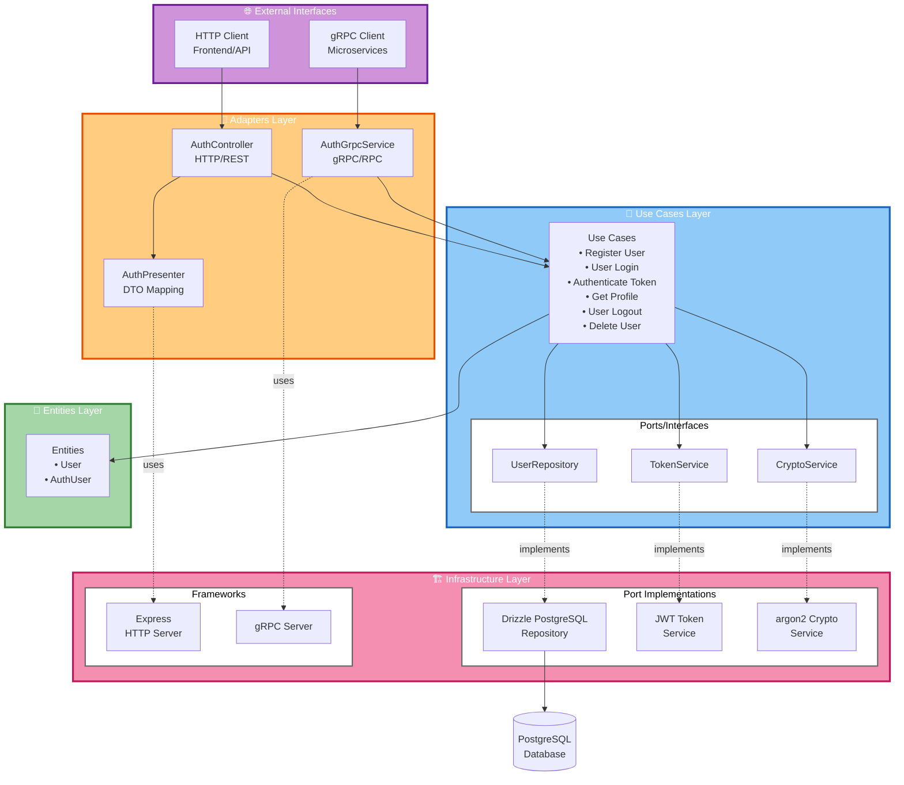

# Auth Service - Clean Architecture

## Architecture Diagram

```mermaid
graph TB
    subgraph External["🌐 External Interfaces"]
        HTTP[HTTP Client<br/>Frontend/API]
        GRPC[gRPC Client<br/>Microservices]
    end

    subgraph Adapters["🔌 Adapters Layer"]
        Controller[AuthController<br/>HTTP/REST]
        GrpcService[AuthGrpcService<br/>gRPC/RPC]
        Presenter[AuthPresenter<br/>DTO Mapping]
    end

    subgraph UseCases["🎯 Use Cases Layer"]
        UseCaseBox["Use Cases<br/>• Register User<br/>• User Login<br/>• Authenticate Token<br/>• Get Profile<br/>• User Logout<br/>• Delete User"]
        
        subgraph Ports["Ports/Interfaces"]
            UserRepo[UserRepository]
            TokenSvc[TokenService]
            CryptoSvc[CryptoService]
        end
    end

    subgraph Entities["💎 Entities Layer"]
        EntityBox["Entities<br/>• User<br/>• AuthUser"]
    end

    subgraph Infrastructure["🏗️ Infrastructure Layer"]
        subgraph Implementations["Port Implementations"]
            DrizzleRepo[Drizzle PostgreSQL<br/>Repository]
            JWTService[JWT Token<br/>Service]
            ArgonService[argon2 Crypto<br/>Service]
        end
        
        subgraph Frameworks["Frameworks"]
            Express[Express<br/>HTTP Server]
            GrpcServer[gRPC Server]
        end
    end
    
    Database[(PostgreSQL<br/>Database)]

    HTTP --> Controller
    GRPC --> GrpcService
    
    Controller --> UseCaseBox
    GrpcService --> UseCaseBox
    
    UseCaseBox --> UserRepo
    UseCaseBox --> TokenSvc
    UseCaseBox --> CryptoSvc
    UseCaseBox --> EntityBox
    
    UserRepo -.implements.-> DrizzleRepo
    TokenSvc -.implements.-> JWTService
    CryptoSvc -.implements.-> ArgonService
    
    DrizzleRepo --> Database
    
    Controller --> Presenter
    Presenter -.uses.-> Express
    GrpcService -.uses.-> GrpcServer

    style Entities fill:#a5d6a7,stroke:#2e7d32,stroke-width:3px,color:#fff
    style UseCases fill:#90caf9,stroke:#1565c0,stroke-width:3px,color:#fff
    style Adapters fill:#ffcc80,stroke:#e65100,stroke-width:3px,color:#fff
    style Infrastructure fill:#f48fb1,stroke:#c2185b,stroke-width:3px,color:#fff
    style External fill:#ce93d8,stroke:#6a1b9a,stroke-width:3px,color:#fff
    style Ports fill:#fff,stroke:#666,stroke-width:2px,color:#000
    style Implementations fill:#fff,stroke:#666,stroke-width:2px,color:#000
    style Frameworks fill:#fff,stroke:#666,stroke-width:2px,color:#000
```